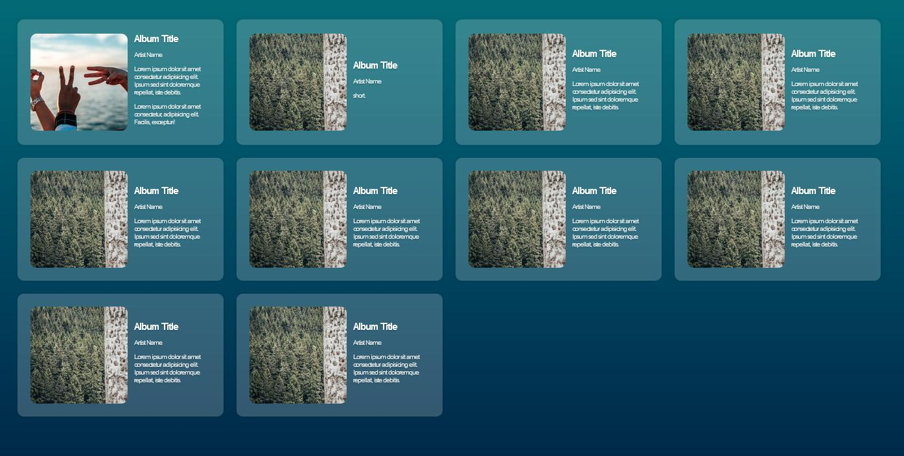
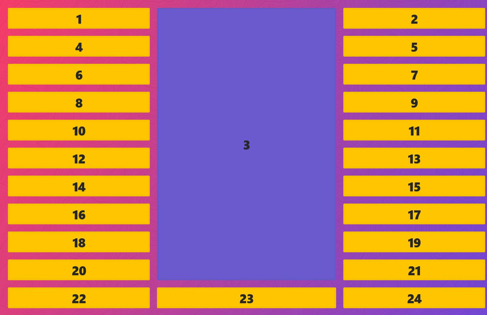
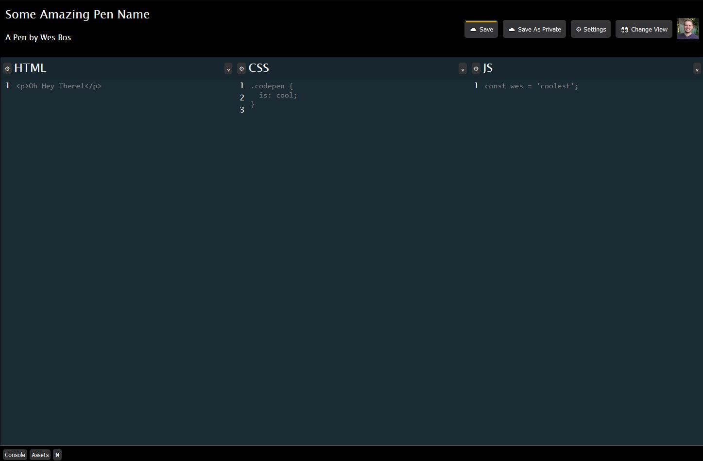
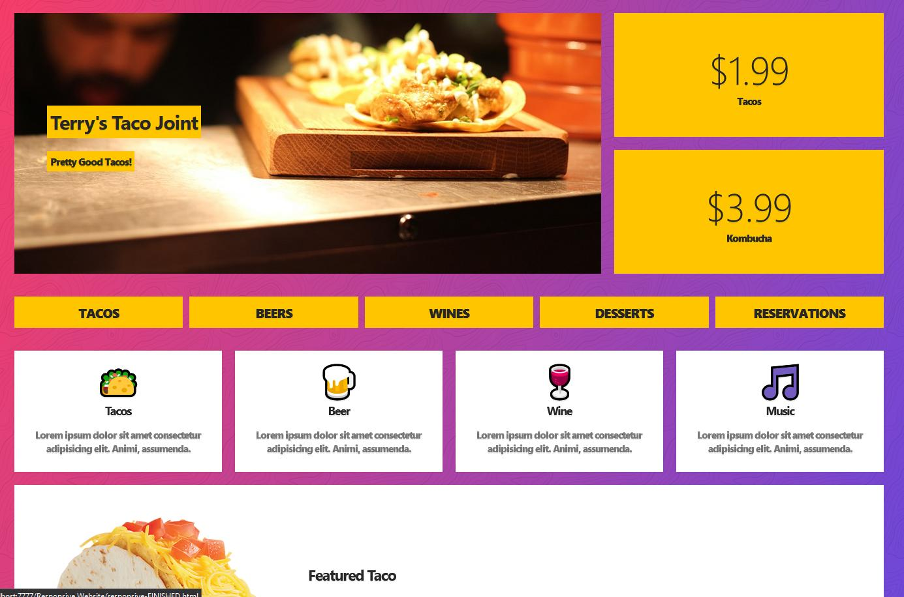
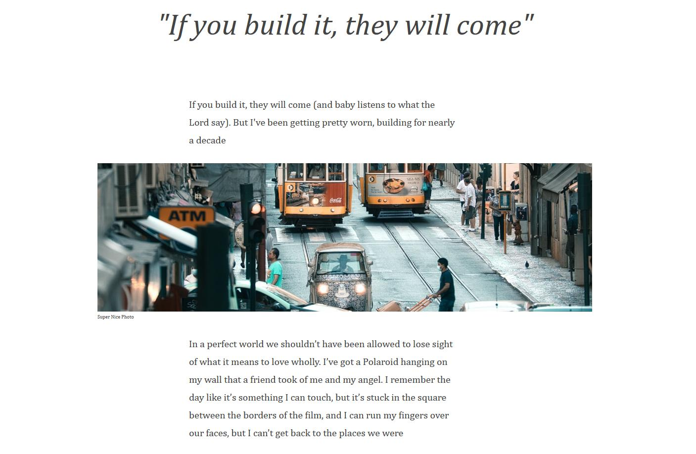

# Some Examples using Grid and Flexbox
## Was mounted on a node js server

First at all, install node_modules
```
npm i
```
Run server with:
```
npm start
```

## Examples in this project:

### Album Cards


---

### Span Items


---

### Recreating CodePen 


---

### Responsive Website


---

### Blog Layout


---

### Collage Galery


---